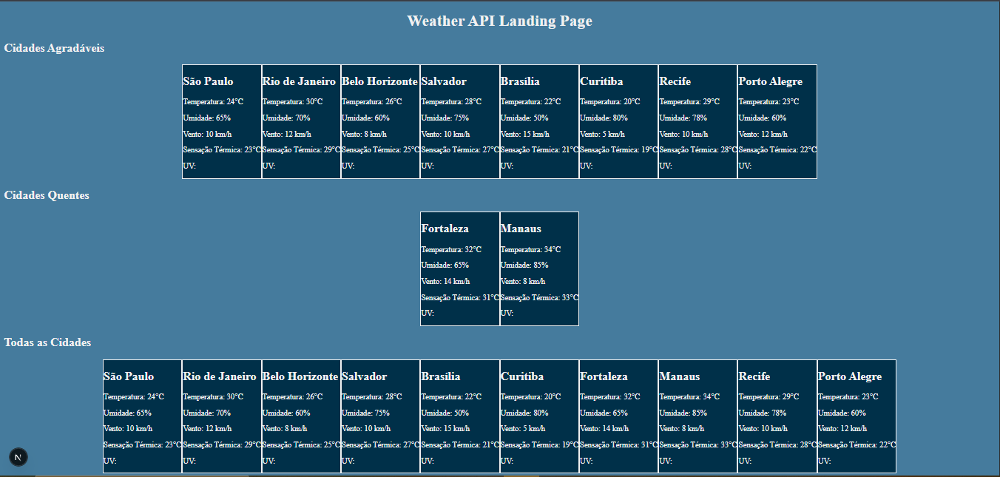
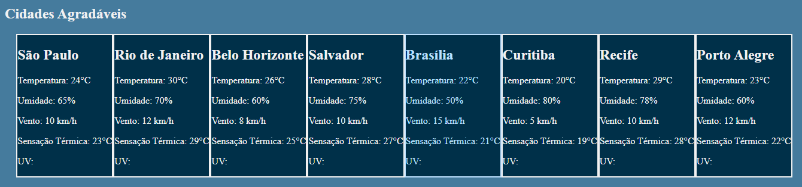

# 🌨️Weather API Documentação 🌦️

## Problema 🏗️
Encontramos várias dificuldades de achar dados de climas das cidades brasileiras, tanto para nós, desenvolvedores, quanto para pessoas que querem curtir um passeio no parque. E não consegue saber o clima da sua cidade ou até de outra cidade se está agradável ou quente demais.

## Solução 💡
Criamos uma API que fornece informações meteorológicas de algumas cidades, incluindo temperatura, umidade, velocidade do vento e UV, notificando ao usuário se essa cidade está em condições agradáveis para caminhar ou está em condições não agradáveis, de formas simples e objetivas.

## Ferramentas Utilizadas 🧰
- **Node.js**: Para construir o backend da API.
- **Express.js (Vs.^5.1.0)**: Framework para gerenciar rotas.
- **JavaScirpt [ESModules]**: Utilizado para construir todas as funcionalidades da API.
- **Typescript**
- **Nodemon (Vs.^3.1.10)**
- **cors (Vs.^2.8.5)**
- **Next (Vs.^15.3.5)**
- **TailwindCSS (Vs.^4.1.11)**

## Configuração 🛠️

Para conseguir utilizar nossa aplicação voce dever seguir os seguintes passos:

**1. Instalação dos pacotes:**
Após fazerem a clonavem do repositorio, basta apenas utilzar o seguinte comando:

```http
	npm install
```

**OBS:** Caso acontença error na instalação dos pacotes, recomendo entrar diretamente na pastas desses pacotes.

**Exemplo:**

```http
	cd ../weatherAPI/backend/
```
**OU**

```http
	cd ../weatherAPI/frontend/my-weather-api/
```

Após esse processo, faça `npm install` nas respectiva pastas.

## Inicialização 🔌

Pronto, após o processo de configuração será bem simples inicializar a Landing Page da API. Seguirá os seguintes passos:

**1.Acessar a raiz da API e do NEXT**

```http
	cd ../weatherAPI/backend/

	cd ../weatherAPI/frontend/my-weather-api/
```

**2.Inicializar o servido local tanto do NEXT e da API**

```http
	npm run start
```
Para inicializar a API, na pasta `../weatherAPI/backend/`.

```http
	npm run dev
```
Para inicializar o servidor NEXT, na pasta `../weatherAPI/frontend/my-weather-api/`.

**OBS:** Caso ocorrar error, verifique todos os passos anteriores ou instalações do pacotes.

## Resultado 🚀

<div>
	
</div>

<div>
	
</div>

<div>
	
</div>

## Estrutura da API

### 1. Obter Apenas Cidade Selecionada
**Endpoint**: `/pesquisa/:nome`  
**Método**: `GET`   
**Descrição**: Este endpoint permitirá que o usuário busque informações sobre uma cidade específica, onde `:nome` é o nome da cidade que o usuário deseja pesquisar.

**Exemplo de Requisição**:
```http
GET /pesquisa/São Paulo
```

**Resposta**:
```json
{
	"cidade": "São Paulo",
	"temperatura": 24,
	"umidade": 65,
	"vento": 10,
	"sensacaoTermica": 23,
	"uv": 5,
	"notificacao": "Temperatura agradável"
}
```

### 2. Obter Cidades Com Clima Agradáveis
**Endpoint**: `/agradaveis`  
**Método**: `GET`  

**Descrição**: Este endpoint permitirá que o usuário busque informações sobre cidades que têm condições "Bom para caminhar" ou "Temperatura agradável".

**Exemplo de Requisição**:
```http
GET /agradaveis
```

**Resposta**:
```json
{
		"cidade": "Rio de Janeiro",
		"temperatura": 30,
		"umidade": 70,
		"vento": 12,
		"sensacaoTermica": 29,
		"uv": 7
},
{
		"cidade": "Belo Horizonte",
		"temperatura": 26,
		"umidade": 60,
		"vento": 8,
		"sensacaoTermica": 25,
		"uv": 6
}
```

### 3. Obter Cidades Com Altas Temperaturas
**Endpoint**: `/quentes`  
**Método**: `GET`  

**Descrição**: Este endpoint permitirá que o usuário busque informações sobre cidades que têm condições "Muito Quente".

**Exemplo de Requisição**:
```http
GET /quentes
```

**Resposta**:
```json
{
		"cidade": "Fortaleza",
		"temperatura": 32,
		"umidade": 65,
		"vento": 14,
		"sensacaoTermica": 31,
		"uv": 9
},
{
		"cidade": "Manaus",
		"temperatura": 34,
		"umidade": 85,
		"vento": 8,
		"sensacaoTermica": 33,
		"uv": 10
}
```

## Observação
Todas as cidades utilizadas dessa API, são dados simulados. Para lista todas as cidades utilizadas, use:

**Endpoint**: `/`  
**Método**: `GET`

**Exemplo de Requisição**:
```http
GET /
```
**Resposta**:
```json
{
		"cidade": "São Paulo",
		"temperatura": 24,
		"umidade": 65,
		"vento": 10,
		"sensacaoTermica": 23,
		"uv": 5
	},
	{
		"cidade": "Rio de Janeiro",
		"temperatura": 30,
		"umidade": 70,
		"vento": 12,
		"sensacaoTermica": 29,
		"uv": 7
	},
	{
		"cidade": "Belo Horizonte",
		"temperatura": 26,
		"umidade": 60,
		"vento": 8,
		"sensacaoTermica": 25,
		"uv": 6
	},
	{
		"cidade": "Salvador",
		"temperatura": 28,
		"umidade": 75,
		"vento": 10,
		"sensacaoTermica": 27,
		"uv": 8
	},
	{
		"cidade": "Brasília",
		"temperatura": 22,
		"umidade": 50,
		"vento": 15,
		"sensacaoTermica": 21,
		"uv": 4
	},
	{
		"cidade": "Curitiba",
		"temperatura": 20,
		"umidade": 80,
		"vento": 5,
		"sensacaoTermica": 19,
		"uv": 3
	},
	{
		"cidade": "Fortaleza",
		"temperatura": 32,
		"umidade": 65,
		"vento": 14,
		"sensacaoTermica": 31,
		"uv": 9
	},
	{
		"cidade": "Manaus",
		"temperatura": 34,
		"umidade": 85,
		"vento": 8,
		"sensacaoTermica": 33,
		"uv": 10
	},
	{
		"cidade": "Recife",
		"temperatura": 29,
		"umidade": 78,
		"vento": 10,
		"sensacaoTermica": 28,
		"uv": 6
	},
	{
		"cidade": "Porto Alegre",
		"temperatura": 23,
		"umidade": 60,
		"vento": 12,
		"sensacaoTermica": 22,
		"uv": 5
	}
```